# 🚀 ATA Intune Device Checker for iOS

📱 **ATA Intune Device Checker**, Microsoft Intune ile yönetilen cihazların durumlarını kolayca kontrol etmenizi, yönetmenizi ve Intune’un sunduğu **senkronizasyon (sync), uzaktan silme (wipe), emekliye ayırma (retire) ve cihaz kaldırma (delete)** gibi yönetim özelliklerini **mobil bir uygulama üzerinden** kullanmanızı sağlar.  

Bu uygulama **IT profesyonelleri** için özel olarak geliştirilmiştir ve **Microsoft Graph API entegrasyonu** sayesinde **Azure Enterprise Application’a bağlanarak** cihaz yönetimini mümkün hale getirir.

---

## 🎯 **Öne Çıkan Özellikler**
✅ **Microsoft Intune Entegrasyonu** – Azure Graph API ile yetkilendirme ve cihaz yönetimi.  
✅ **Cihaz Yönetimi** – **Sync, Wipe, Retire, Delete** gibi işlemleri kolayca gerçekleştirme.  
✅ **Uyumluluk (Compliance) Kontrolü** – Cihazların **Compliant (uyumlu) / Non-Compliant (uyumsuz)** durumlarını gösterme.  
✅ **Gerçek Zamanlı Senkronizasyon** – Tüm cihazları anlık olarak listeleme ve filtreleme.  
✅ **Güvenli Kimlik Doğrulama** – **Microsoft Authentication Library (MSAL)** ile güçlü güvenlik.  
✅ **Cihaz Arama & Filtreleme** – Belirli bir cihazı **seri numarası, adı veya üreticisine göre** arayabilme.  

---

## 📸 **Ekran Görüntüleri**

| **Kimlik Doğrulama**  
| 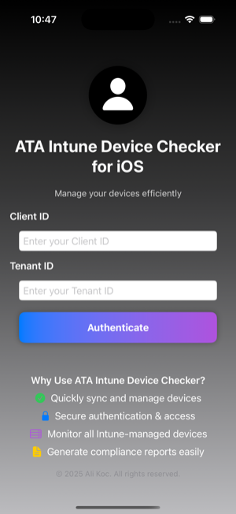 | 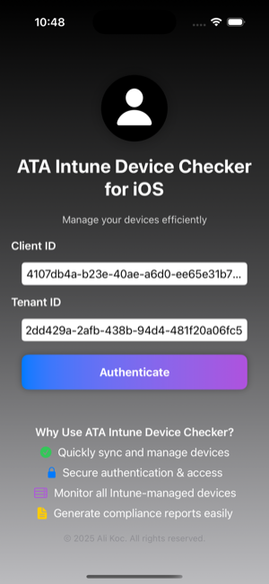 | 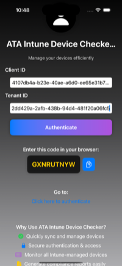 | 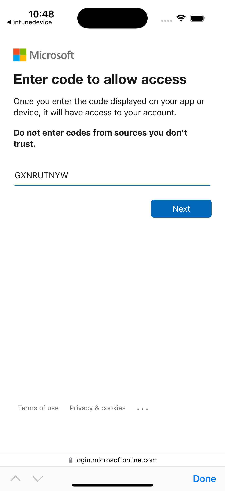 | 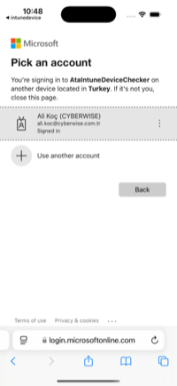 | 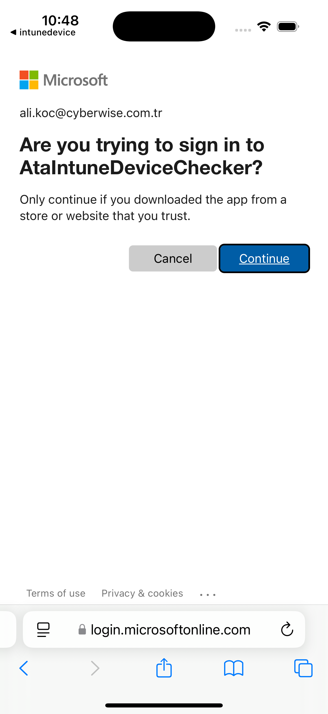 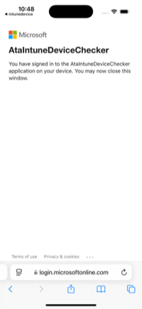

| **Cihaz Listesi** 

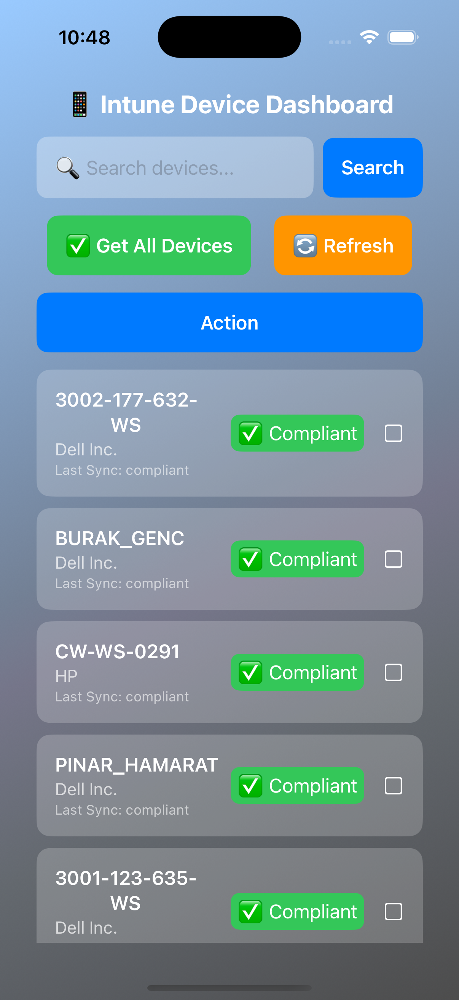 | 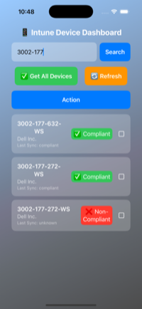 | 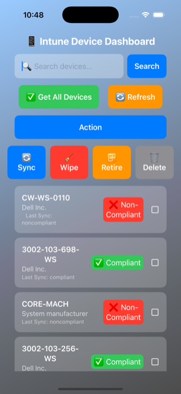 | 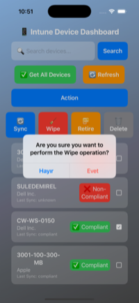 | 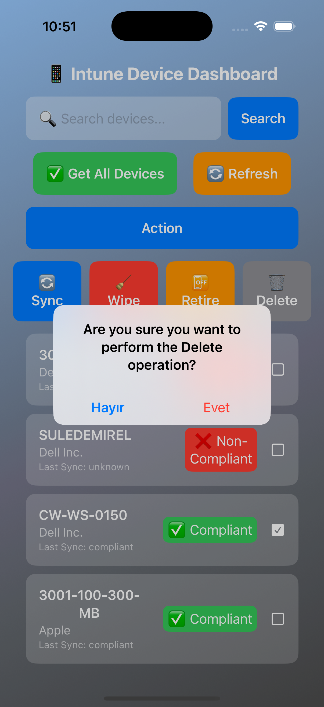 | 

**Cihaz Uyumluluk Durumu**
[Compliant](screenshots/compliant.png)

---

## 🛠️ **Kurulum ve Kullanım**

# 🛠️ App Registration & Yetkilendirme  

📌 **ATA Intune Device Checker**, **Microsoft Graph API** aracılığıyla cihaz yönetimi gerçekleştirdiği için **Azure AD üzerinde bir App Registration (Uygulama Kaydı)** oluşturulması ve **ilgili yetkilerin (permissions) verilmesi gerekmektedir**.  

Bu kılavuz, **Azure Active Directory (Azure AD)** üzerinde **uygulama kaydı oluşturma ve gerekli izinleri verme** adımlarını içermektedir.  

---

## **📌 1️⃣ Azure Portal’da Uygulama Kaydı Oluşturma**  
1. **Azure Portal’a giriş yap:**  
   🔗 [Azure AD Uygulama Kayıtları](https://portal.azure.com/#blade/Microsoft_AAD_RegisteredApps/ApplicationsListBlade) sayfasına git.  
2. **"New Registration" (Yeni Kayıt)** butonuna tıkla.  
3. **Application Name (Uygulama Adı)** olarak **ATA Intune Device Checker** yaz.  
4. **Desteklenen hesap türü:**  
   - Eğer **tüm tenant’larda kullanılmasını istiyorsan:**  
     ✅ **"Accounts in any organizational directory (Any Azure AD directory - Multitenant)"** seçeneğini seç.  
   - Eğer **sadece kendi organizasyonun içinde çalışacaksa:**  
     ✅ **"Accounts in this organizational directory only (Single tenant)"** seçeneğini seç.  
5. **Redirect URI (Geri Çağırma URL’si):**  
   - Platform olarak **iOS/macOS** seç.  
   - `msauth.<bundle_id>://auth` şeklinde gir (**Xcode'daki Bundle ID’ye göre değişir**).  
6. **"Register" (Kaydet) butonuna tıkla** ve uygulama kaydını oluştur.  

---

## **📌 2️⃣ API Permissions (Gerekli Yetkileri Verme)**  
📌 **ATA Intune Device Checker** uygulamasının **Microsoft Graph API’ye erişebilmesi için aşağıdaki yetkileri eklemelisin**.  

1. **Azure Portal’da "App registrations" (Uygulama Kayıtları) sekmesine git.**  
2. **Uygulamanı seç.**  
3. Sol menüden **"API Permissions" (API İzinleri)** sekmesine git.  
4. **"Add a permission" (İzin Ekle) butonuna tıkla.**  
5. **Microsoft Graph API’yi seç.**  

### **📌 Gerekli Yetkiler (Permissions):**  

| **Yetki Adı** | **Yetki Türü** | **Açıklama** |
|--------------|--------------|-------------|
| `Device.Read.All` | **Delegated** | Tenant içindeki cihaz bilgilerini okuma. |
| `DeviceManagementManagedDevices.Read.All` | **Delegated** | Yönetilen cihazları okuma. |
| `DeviceManagementManagedDevices.PrivilegedOperations.All` | **Delegated** | Yönetilen cihazlar üzerinde özel işlemler gerçekleştirme (örn: wipe, sync, retire, delete). |
| `DeviceManagementManagedDevices.ReadWrite.All` | **Delegated** | Yönetilen cihazları okuma ve güncelleme. |

📌 **Yetkileri nasıl ekleyebilirim?**  
1. **"Add a permission" (İzin Ekle) butonuna bas.**  
2. **"Microsoft Graph" → "Delegated permissions" seçeneğini seç.**  
3. Yukarıdaki yetkileri tek tek seç.  
4. **"Add permissions" (İzinleri ekle) butonuna bas.**  
5. **Yetkilerin uygulanabilmesi için "Grant admin consent" (Yönetici Onayı Ver) butonuna bas.**  

✅ **Eğer "Grant admin consent" butonu pasifse, Global Admin yetkisine sahip birinin onay vermesi gerekmektedir.**

