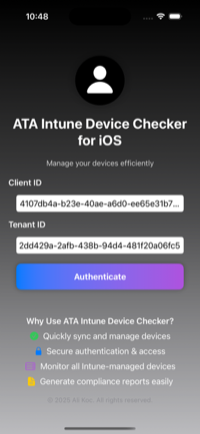

# 🚀 ATA Intune Device Checker for iOS

📱 ATA Intune Device Checker allows you to easily check and manage the status of devices managed by Microsoft Intune. It enables IT professionals to use key Intune management features such as sync, remote wipe, retire, and delete directly from a mobile application.

This application is specifically designed for IT professionals and leverages Microsoft Graph API integration to connect with Azure Enterprise Applications, enabling seamless device management.


---

## 🎯 **Key Features**
✅ Microsoft Intune Integration – Authorization and device management via Azure Graph API.

✅ Device Management – Easily perform actions like Sync, Wipe, Retire, and Delete.

✅ Compliance Check – Displays device status as Compliant (In Compliance) / Non-Compliant (Out of Compliance)

✅ Real-Time Synchronization – Instantly list and filter all devices.

✅ Secure Authentication – Strong security with Microsoft Authentication Library (MSAL).

✅ Device Search & Filtering – Search for specific devices by serial number, name, or manufacturer.

---

## 📸 **Screenshots**

| **Id Authorization**  
|  |  |  |  |  |  

| **Device List** 

 |  |  |  |  | 

**Device Compliance Policy**
[Compliant](screenshots/compliant.png)

---

## 🛠️ **Setup**

# 🛠️ App Registration & Permissons  

📌 ATA Intune Device Checker performs device management through Microsoft Graph API, so an App Registration must be created in Azure AD, and the necessary permissions must be granted.

This guide includes the steps for creating an app registration and granting the necessary permissions in Azure Active Directory (Azure AD).
---

# 📌 ATA Intune Device Checker - Azure AD App Registration Guide  

This guide provides the steps for **registering an application in Azure Active Directory (Azure AD)** and **granting the necessary permissions** to enable it to function properly.

---

## 📌 1️⃣ App Registration in Azure Portal  

### **Step 1: Log in to Azure Portal**  
🔗 [Azure AD App Registration](https://portal.azure.com/#blade/Microsoft_AAD_RegisteredApps/ApplicationsListBlade)  

### **Step 2: Register a New Application**  
1. Click **"New Registration"**  
2. Enter **"ATA Intune Device Checker"** as the **Application Name**.  
3. **Select the supported account type:**
   - If you want the application to be used across multiple tenants:  
     ✅ **"Accounts in any organizational directory (Any Azure AD directory - Multitenant)"**  
   - If the application will only be used within your organization:  
     ✅ **"Accounts in this organizational directory only (Single tenant)"**  
4. **Set Redirect URI (Callback URL):**  
   - Choose **iOS/macOS** as the platform.  
   - Enter the Redirect URI in the format:  
     ```
     https://login.microsoftonline.com/common/oauth2/nativeclient
     ```
     (**This value should match your Bundle ID in Xcode**).
5. Click **"Register"** to create the application registration.

---

## 📌 2️⃣ API Permissions (Grant Required Permissions)  

📌 **The ATA Intune Device Checker application requires the following permissions to access Microsoft Graph API.**  

### **Step 1: Navigate to API Permissions**  
1. Go to **Azure Portal → App registrations**  
2. Select your registered application.  
3. In the left panel, click **"API Permissions"**.  
4. Click **"Add a permission"**.  
5. Select **"Microsoft Graph"**.

### **📌 Required Permissions**  

| **Permission Name** | **Type** | **Description** |
|--------------------|---------|----------------|
| `Device.Read.All` | **Delegated** | Read device information within the tenant. |
| `DeviceManagementManagedDevices.Read.All` | **Delegated** | Read managed devices. |
| `DeviceManagementManagedDevices.PrivilegedOperations.All` | **Delegated** | Perform privileged operations on managed devices (e.g., wipe, sync, retire, delete). |
| `DeviceManagementManagedDevices.ReadWrite.All` | **Delegated** | Read and modify managed devices. |

### **Step 2: Add Permissions**  
1. Click **"Add a permission"**.  
2. Select **"Microsoft Graph" → "Delegated permissions"**.  
3. Select the permissions listed above.  
4. Click **"Add permissions"**.  
5. Click **"Grant admin consent"** to apply the permissions.

✅ **If the "Grant admin consent" button is disabled, a Global Admin must approve the permissions.**  
